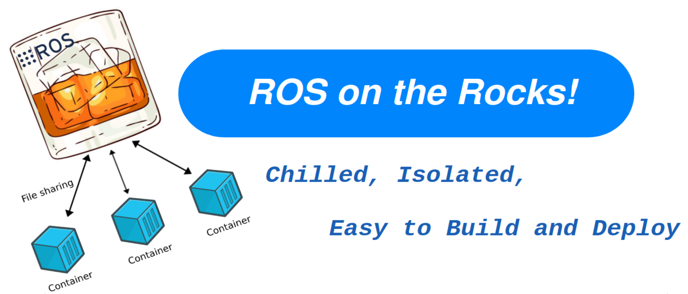

<div align="center">

# 🐳 ROS-on-Rocks 🚀




**A Modern ROS2 Development Environment Template**

*Rock-solid ROS2 development with Docker containers* 🎯

[](https://opensource.org/licenses/MIT)
[](http://makeapullrequest.com)
[](https://github.com/your-username/ros-on-rocks/graphs/contributors)

</div>

---

## 🌟 What is ROS-on-Rocks?

**ROS-on-Rocks** is a comprehensive template repository that provides a **modern, containerized development environment** for ROS2 projects. It combines the power of Docker with ROS2 to create a consistent, reproducible, and easy-to-setup development experience.

### ✨ Key Features

- 🐳 **Dockerized Environment** - Consistent development across all platforms
- 🚀 **ROS2 Humble Ready** - Latest ROS2 distribution with all essential tools
- 🛠️ **VS Code Integration** - Full devcontainer support for seamless development
- 📦 **Template-Based** - Customizable for different project types
- 🔧 **Working Examples** - Complete talker/listener demonstration
- 🌐 **Open Source** - MIT licensed, community-driven

---

## 🚀 Quick Start

### Prerequisites

- [Docker](https://docs.docker.com/get-docker/) (20.10+)
- [Docker Compose](https://docs.docker.com/compose/install/) (2.0+)
- [VS Code](https://code.visualstudio.com/) with [Dev Containers extension](https://marketplace.visualstudio.com/items?itemName=ms-vscode-remote.remote-containers)

### 🎯 Get Started in 3 Steps

1. **Clone the Template**
   ```bash
   git clone https://github.com/your-username/ros-on-rocks.git my-ros-project
   cd my-ros-project
   ```

2. **Open in VS Code**
   ```bash
   code .
   # Click "Reopen in Container" when prompted
   ```

3. **Run the Example**
   ```bash
   # Import dependencies
   vcs import src < src/laucher/deps.repos
   
   # Build packages
   colcon build
   
   # Run talker/listener example
   docker compose -f src/laucher/services.yml up
   ```

**That's it!** 🎉 You now have a fully functional ROS2 development environment.

---

## 📁 Project Structure

```
ros-on-rocks/
├── 🐳 .devcontainer/           # Docker configuration
│   ├── Dockerfile              # Main container template
│   ├── dev.yml                 # VS Code devcontainer config
│   ├── build-devcontainer.sh   # Build script
│   └── source.bash             # ROS2 environment setup
├── 📦 src/laucher/             # Example services
│   ├── deps.repos              # ROS2 dependencies
│   ├── services.yml            # Docker Compose services
│   └── launch.sh               # Service management script
├── 📄 README.md                # This file
└── 🖼️ ros-on-rocks.png         # Project logo
```

---

## 🛠️ Customization Guide

### Dockerfile Template

The `Dockerfile` is designed as a template with commented sections:

```dockerfile
# PROJECT-SPECIFIC DEPENDENCIES (CUSTOMIZE THESE)
# Uncomment the sections you need:

# Basic ROS2 packages
RUN apt-get update && apt-get install -y \
    ros-humble-rclcpp ros-humble-rclpy \
    ros-humble-std-msgs ros-humble-geometry-msgs \
    && rm -rf /var/lib/apt/lists/*

# URDF and visualization
# RUN apt-get update && apt-get install -y \
#     ros-humble-xacro ros-humble-joint-state-publisher-gui ros-humble-rviz2 \
#     liburdfdom-tools \
#     && rm -rf /var/lib/apt/lists/*

# MoveIt motion planning
# RUN apt-get update && apt-get install -y \
#     ros-humble-moveit ros-humble-moveit-ros-planning-interface \
#     ros-humble-moveit-kinematics ros-humble-moveit-planners-ompl \
#     && rm -rf /var/lib/apt/lists/*
```

### Available Sections

- 🤖 **Basic ROS2** - Core packages for simple projects
- 🎨 **URDF/Visualization** - Robot description and RViz
- 🦾 **MoveIt** - Motion planning and manipulation
- 🎮 **Control Systems** - ROS2 control framework
- 🌍 **Simulation** - Gazebo integration
- 🖥️ **GUI Tools** - RQT and visualization tools
- 🔍 **Development** - Linting and debugging tools

---

## 🎮 Working Example

This template includes a **complete talker/listener demonstration**:

### Services
- **`talker`** - C++ publisher sending messages to `/topic`
- **`listener`** - C++ subscriber receiving and printing messages
- **`py_talker`** - Python publisher (alternative implementation)

### Commands
```bash
# Start the example
docker compose -f src/laucher/services.yml up

# In another terminal, monitor topics
docker exec -it talker ros2 topic list
docker exec -it talker ros2 topic echo /topic
```

---

## 🤝 Contributing

We welcome contributions from the community! Here's how you can help:

### 🐛 Bug Reports
- Use GitHub Issues to report bugs
- Include system information and error logs
- Provide steps to reproduce the issue

### 💡 Feature Requests
- Suggest new features via GitHub Issues
- Explain the use case and benefits
- Consider contributing the implementation

### 🔧 Code Contributions

1. **Fork the repository**
   ```bash
   git clone https://github.com/your-username/ros-on-rocks.git
   cd ros-on-rocks
   ```

2. **Create a feature branch**
   ```bash
   git checkout -b feature/amazing-feature
   ```

3. **Make your changes**
   - Follow the existing code style
   - Add tests if applicable
   - Update documentation

4. **Test your changes**
   ```bash
   ./build-devcontainer.sh
   # Test your changes in the container
   ```

5. **Submit a pull request**
   - Provide a clear description
   - Link any related issues
   - Include screenshots if UI changes

### 📋 Development Guidelines

- **Code Style**: Follow existing patterns and conventions
- **Documentation**: Update README and comments as needed
- **Testing**: Test changes in the container environment
- **Commits**: Use clear, descriptive commit messages

---

## 🏗️ Advanced Usage

### Custom Dependencies

Add your project-specific packages to `src/laucher/deps.repos`:

```yaml
repositories:
  my_custom_package:
    type: git
    url: https://github.com/your-org/my-package.git
    version: main
```

### Multiple Services

Extend `src/laucher/services.yml` for complex applications:

```yaml
services:
  my_service:
    <<: *common-parameters
    container_name: my_service
    command: ["ros2", "run", "my_package", "my_node"]
    depends_on:
      - talker
```

### Environment Variables

Customize the environment in `.devcontainer/dev.yml`:

```yaml
environment:
  - ROS_DOMAIN_ID=42
  - CUSTOM_VAR=value
```

---

## 📚 Resources

### Documentation
- [ROS2 Documentation](https://docs.ros.org/en/humble/)
- [Docker Documentation](https://docs.docker.com/)
- [VS Code Dev Containers](https://code.visualstudio.com/docs/remote/containers)

### Community
- [ROS Discourse](https://discourse.ros.org/)
- [ROS Answers](https://answers.ros.org/)
- [Docker Community](https://forums.docker.com/)

### Related Projects
- [ROS2 Docker Images](https://hub.docker.com/_/ros)
- [MoveIt Docker](https://github.com/ros-planning/moveit_docker)
- [Gazebo Docker](https://github.com/osrf/docker_images)

---

## 📄 License

This project is licensed under the MIT License - see the [LICENSE](LICENSE) file for details.

---

## 🙏 Acknowledgments

- **ROS2 Community** - For the amazing robotics framework
- **Docker Team** - For containerization technology
- **VS Code Team** - For excellent development tools
- **Contributors** - For making this project better

---

<div align="center">

**Made with ❤️ by the ROS-on-Rocks Community**

[⭐ Star this repo](https://github.com/your-username/ros-on-rocks) | [🐛 Report Bug](https://github.com/your-username/ros-on-rocks/issues) | [💡 Request Feature](https://github.com/your-username/ros-on-rocks/issues) | [📖 Documentation](https://github.com/your-username/ros-on-rocks/wiki)

</div>

