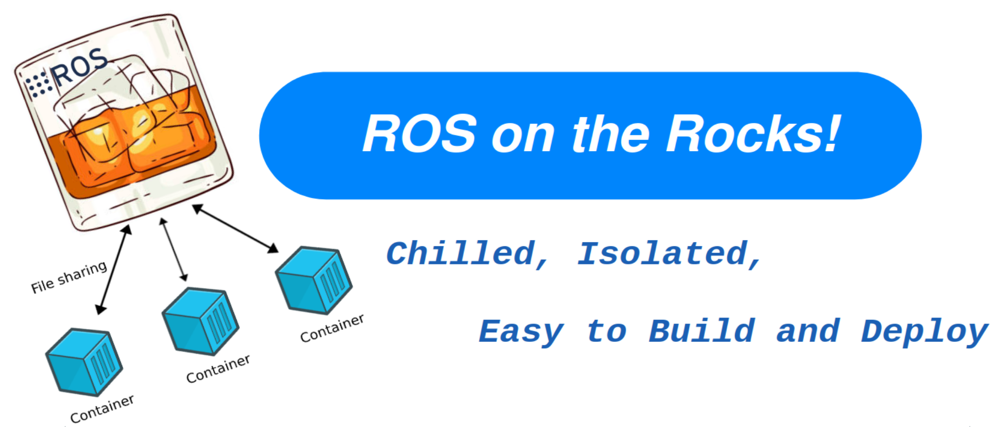

<div align="center">

# 🐳 ROS-on-Rocks 🚀




**A Modern ROS2 Development Environment Template**

*Rock-solid ROS2 development with Docker containers* 🎯

[](https://opensource.org/licenses/MIT)
[](http://makeapullrequest.com)
[](https://github.com/touchlab-avatarx/ros-on-rocks/graphs/contributors)

</div>

---

## 🌟 What is ROS-on-Rocks?

**ROS-on-Rocks** is a template repository for containerized ROS2 Jazzy workspaces on a Linux host. It covers the full image chain: a base image with your binary dependencies, a VS Code dev container for day-to-day work, Docker Compose services, and a release image for deployment.

### ✨ Key Features

- 🐳 **Dockerized Environment** - Dev image built to match your host user (UID/GID, docker group)
- 🚀 **ROS2 Jazzy Ready** - Current LTS, with build tools, vcstool, tmux and RViz2 in the example base image
- 🛠️ **VS Code Integration** - Dev Containers config with ROS, C++, Python and CMake extensions
- 🔧 **Working Examples** - Base image, `publisher`/`hz` services, and a deployment image
- 🖥 **GUI and GPU support** - X11 forwarding, NVIDIA by default with a generic `/dev/dri` option
- 🌐 **Open Source** - MIT licensed

---

## 🚀 Quick Start

### Prerequisites

- [Docker](https://docs.docker.com/get-docker/) with the Compose v2 plugin (`docker compose`)
- [VS Code](https://code.visualstudio.com/) with the [Dev Containers extension](https://marketplace.visualstudio.com/items?itemName=ms-vscode-remote.remote-containers)
- NVIDIA driver + [NVIDIA Container Toolkit](https://docs.nvidia.com/datacenter/cloud-native/container-toolkit/latest/install-guide.html), or switch to the generic GPU option (see [GPU choice](#-create-a-workspace-from-this-template))
- Optional: `GIT_AUTHOR_NAME`, `GIT_AUTHOR_EMAIL`, `GIT_COMMITTER_NAME`, `GIT_COMMITTER_EMAIL` exported on the host **before the first open**
- For GUI apps, allow local containers to use your X server: `xhost +local:`

### 🎯 Get Started

1. **Clone the template**
   ```bash
   git clone https://github.com/touchlab-avatarx/ros-on-rocks.git my-ros-project
   cd my-ros-project
   ```

2. **Build the base image** (tags `vladimirivan/ros:jazzy-example-base`)
   ```bash
   cd example-base && ./build.bash && cd ..
   ```

3. **Add your packages to `src/`** (each package lives in its own git repo)
   ```bash
   mkdir -p src
   vcs import src < my.repos   # or git clone into src/
   ```

4. **Open in VS Code**
   ```bash
   code .
   # Click "Reopen in Container" when prompted
   ```

5. **Build and run**
   ```bash
   cb       # colcon build the workspace in /ros2
   rviz2    # check that GUI + GPU work
   ```

**That's it!** 🎉 The repo is mounted at `/ros2` inside the container.

---

## 📁 Project Structure

```
ros-on-rocks/
├── 🐳 .devcontainer/
│   ├── Dockerfile              # Dev image, FROM the base image
│   ├── build-devcontainer.sh   # Runs on the host before each open: writes .env (once), builds the image
│   ├── image.yml               # Compose file that builds the dev image
│   ├── dev.yml                 # Compose file that runs the dev container
│   ├── devcontainer.json       # VS Code Dev Containers config, settings, extensions
│   ├── ros_entrypoint.sh       # Sources ROS + source.bash
│   ├── source.bash             # Shell helpers (ws, cb, prompt)
│   └── tm                      # Host-side tmux picker for the dev container
├── 🧱 example-base/            # Base image with binary dependencies (build.bash)
├── 🚢 example-deploy/          # Release image of src/ (deploy.sh) + compose to run it
├── ⚙️ example-service/         # Nodes as Compose services using the dev image
├── 📦 src/                     # Your packages (gitignored)
├── 📄 LICENSE
└── 🖼️ ros-on-rocks.png
```

---

## 🛠️ Workflow

### Image chain

```
ros:jazzy-ros-base-noble
  └─ example-base      ──build.bash──▶ vladimirivan/ros:jazzy-example-base
       ├─ .devcontainer ──(auto)──────▶ ros_jazzy_image          (dev.yml, example-service)
       └─ example-deploy ──deploy.sh──▶ vladimirivan/ros:jazzy-example-deploy
```

Add apt/ROS dependencies to `example-base/Dockerfile`, not to the dev image. Per-user tools go in `example-base/install-user-extras.sh`.

### Shell helpers

Every shell sources `.devcontainer/source.bash` (see its comments):

| Command | Description |
|---------|-------------|
| `ws` | Source ROS and the workspace overlay `/ros2/install/setup.bash` (runs automatically in new shells) |
| `cb [args]` | `colcon build --symlink-install` in RelWithDebInfo from `/ros2`, then `ws`. E.g. `cb --packages-select my_package` |

To run the dev image build by hand (e.g. without VS Code): `bash .devcontainer/build-devcontainer.sh`.

For tmux sessions inside the container, run `.devcontainer/tm` on the host to pick and attach to one.

### Services (dev image)

`example-service/compose.yml` runs `publisher` (publishes `"Hello"` on `/test`) and `hz` (`ros2 topic hz /test`) with the workspace mounted. Requires the dev container to have been opened once (image + `.env`).

```bash
cd example-service && ./start.sh
docker exec -it publisher ros2 topic echo /test
docker logs -f hz
./stop.sh
```

Add your own services by copying a service block; the shared settings come from the `x-common-parameters` anchor.

### Deployment (release image)

`example-deploy/Dockerfile` builds `src/` in Release mode into a self-contained image. The compose file runs the same `publisher`/`hz` services from it.

```bash
./example-deploy/deploy.sh
cd example-deploy && ./start.sh   # ./stop.sh to stop
```

Both examples use the container names `publisher` and `hz`, so stop one before starting the other.

---

## 📋 Create a workspace from this template

Checklist for a new project (humans and AI agents):

1. **Base image**: add your dependencies to `example-base/Dockerfile`, change the tag in `example-base/build.bash`, run `./build.bash`, and set the same tag in the `FROM` line of `.devcontainer/Dockerfile` and `example-deploy/Dockerfile`.
2. **Packages**: list your repos in a `.repos` file and run `vcs import src < my.repos`. `src/` and `*.repos` are gitignored; un-ignore them if you want them in this repo.
3. **Unique names** (needed to run several workspaces on one host):
   - Dev image `ros_${ROS_DISTRO}_image` in `.devcontainer/image.yml`, `.devcontainer/dev.yml` and `example-service/compose.yml` (all must match).
   - `container_name: dev` in `dev.yml`, and `service` / `runServices` in `devcontainer.json` to match. Keep a `dev` prefix if you use `tm`.
   - Devcontainer `"name"` in `devcontainer.json`.
   - Network `ros2_network` and service container names in the compose files.
   - Deploy image tag in `example-deploy/deploy.sh` and `example-deploy/compose.yml`.
4. **`.devcontainer/.env`** is generated once (UID/GID, git identity, repo path, `ROS_DISTRO`, `ROS_DOMAIN_ID`). Set the `GIT_*` variables before the first open. To change values, edit it or delete it to regenerate, then rebuild the container.
5. **ROS distro**: changing `ROS_DISTRO` needs a base image built for that distro (base `FROM` and `ros-<distro>-*` packages in `example-base/Dockerfile`).
6. **GPU choice**: NVIDIA is enabled by default. Without it, comment out the `deploy:` block and uncomment the `/dev/dri` `devices:` option in `.devcontainer/dev.yml`, `example-service/compose.yml` and `example-deploy/compose.yml`.

---

## ⚙️ Container Configuration

The dev container provides X11 forwarding, GPU access, real-time scheduling (`SYS_NICE`, `rtprio`, `memlock`), `/dev` + udev for hardware, the host Docker socket, and a `claude_data` volume for Claude Code state. Each option is explained in the comments of `.devcontainer/dev.yml`; VS Code settings and extensions are in `.devcontainer/devcontainer.json`.

---

## 🤝 Contributing

Bug reports and feature requests go in [GitHub Issues](https://github.com/touchlab-avatarx/ros-on-rocks/issues).
For code changes, fork the repo, test in the dev container, and open a pull request.

---

## 📄 License

This project is licensed under the MIT License - see the [LICENSE](LICENSE) file for details.

---

<div align="center">

**Made with ❤️ by the ROS-on-Rocks Community**

[⭐ Star this repo](https://github.com/touchlab-avatarx/ros-on-rocks) | [🐛 Report Bug](https://github.com/touchlab-avatarx/ros-on-rocks/issues) | [💡 Request Feature](https://github.com/touchlab-avatarx/ros-on-rocks/issues)

</div>
